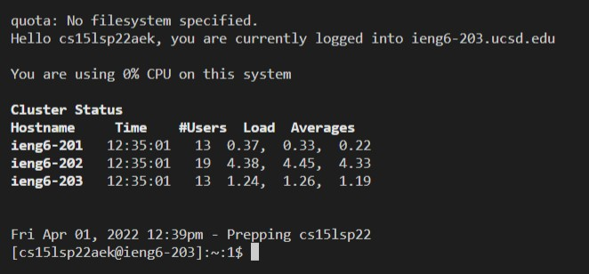
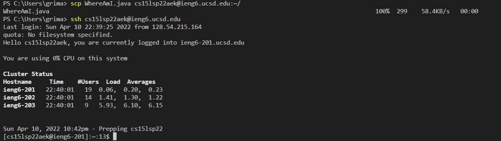
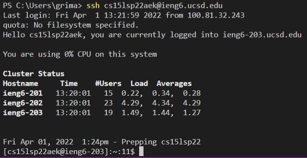
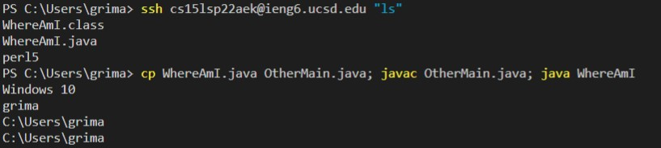

# Week 2 Lab Report

## Installing Visual Studio Code

To begin with I had to setup [Visual Studio Code](https://code.visualstudio.com/). I downloaded the Windows version because I have a PC. I had already downloaded VS Code before so I skipped this step. 

Once I downloaded VS Code my screen looked like this: 

## Remotely Connecting
To remote connect, I first had to install a program called OpenSHH (this step was required for me because I am on Windows). The steps can be found here: 

[Install OpenSSH](https://docs.microsoft.com/en-us/windows-server/administration/openssh/openssh_install_firstuse)

For CSE 15L we have an account that I looked up here: 

[15L Account Look Up](https://sdacs.ucsd.edu/~icc/index.php)

My account was cs15lsp22aek@ieng6.ucsd.edu. So with my account I ran the command `ssh cs15lsp22aek@ieng6.ucsd.edu` and I was able to log in

## Trying Some Commands
I ran the commands: `cd ~`, `cd`, `ls -l`, `ls -a`, `ls -t`, `ls -lat`  

I think that it was pretty interesting how muc data is read from each of the `ls -l`, `ls -a`, `ls -t`, and then put together `ls -lat` combines all of them. 

## Moving Files with scp
For moving the files with `scp` I was able to move the WhereAmI.java file from my computer (client) to the Server. I was able to run WhereAmI using my cs15lsp22 account. I was able to get the output of Linux (which is the server) from runnig the java file. 

## Setting an SSH Key 
I was able to create an SSH key using shh-keygen. I thought I had to do an extra step however that was not the case so I was able to get my keys. Then, I was able to log in without having to input my own password. I got the following when I logged in. 

## Optimizing Remote Running

For this part I ran the code with the quotes after my account `ssh cs15lsp22zz@ieng6.ucsd.edu "ls"
`. Another way that I was able to optimze it was by using semi-colons and adding them to run the compile and run. With these two I was able to get the following:

[Home](https://pgrimaldo03.github.io/cse15l-lab-reports/)