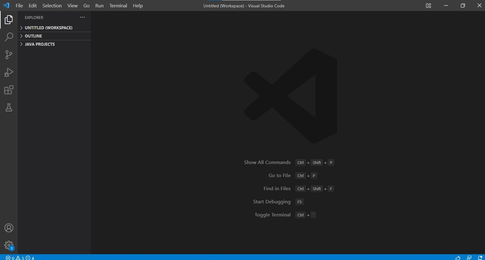
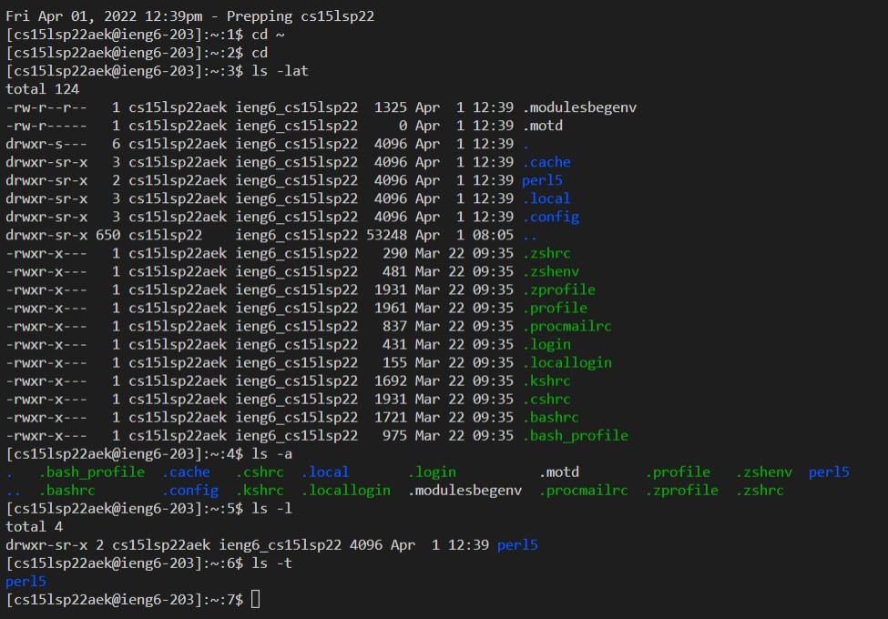

# Week 2 Lab Report

## Installing Visual Studio Code

To begin with I had to setup [Visual Studio Code](https://code.visualstudio.com/). I downloaded the Windows version because I have a PC. I had already downloaded VS Code before so I skipped this step. 

Once I downloaded VS Code my screen looked like this: 

## Remotely Connecting
To remote connect, I first had to install a program called OpenSHH (this step was required for me because I am on Windows). The steps can be found here: 

[Install OpenSSH](https://docs.microsoft.com/en-us/windows-server/administration/openssh/openssh_install_firstuse)

For CSE 15L we have an account that I looked up here: 

[15L Account Look Up](https://sdacs.ucsd.edu/~icc/index.php)

["Connect to a remote host"](https://docs.microsoft.com/en-us/windows-server/administration/openssh/openssh_install_firstuse)

## Trying Some Commands
I ran the commands: `cd ~`, `cd`, `ls -l`, `ls -a`, `ls -t`, `ls -lat`  

## Moving Files with scp
* 
## Setting an SSH Key 
* 
## Optimizing Remote Running
* 
For each step include 2-3 sentences or bullet points describing what you did.
* Installing VScode
* Remotely Connecting
* Trying Some Commands
* Moving Files with scp
* Setting an SSH Key
* Optimizing Remote Running

