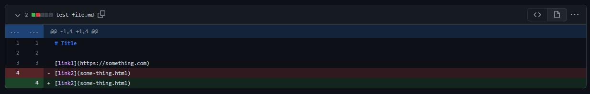
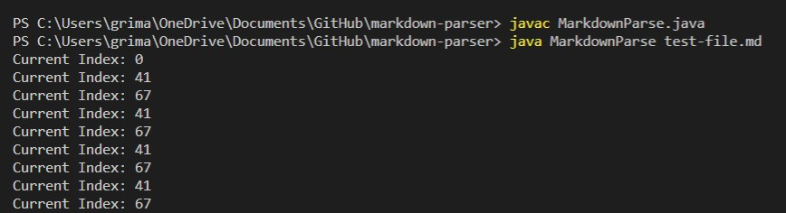
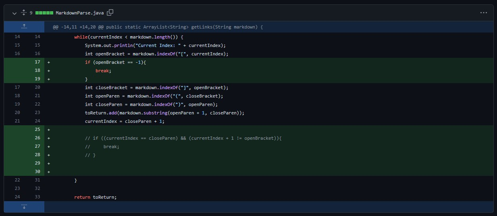
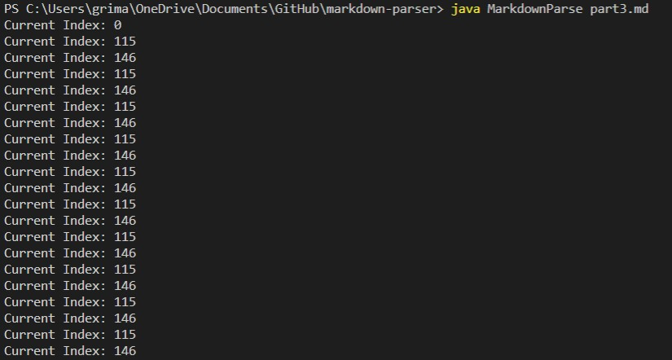
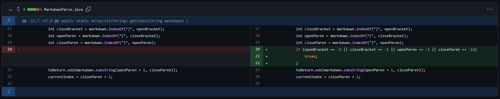
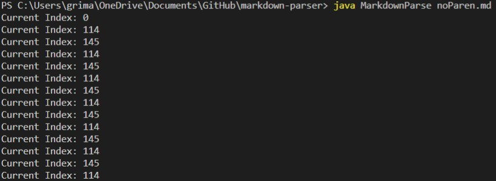

# Week 4 Lab Report

## 1. Extra Line Present

[Test File Link to the Failure-Inducing Input](https://github.com/pgrimaldo03/markdown-parser/blob/main/test-file.md)

The failure-inducing input was the extra space that was after the links. The symptom as shown above was the result of this input, there was no more storage for the loop to keep running so it created the error. All this was because of the bug of having an extra line at the end of the test case. 

## 2. No Open Bracket Present 

[No Open Bracket Test File Link to the Failure-Inducing Input](https://github.com/pgrimaldo03/markdown-parser/blob/main/part3.md)

The bug is that there was an infinite loop as seen through the symptom above. The failure-inducing input was that no openBracket was present so it just kept iterating through the same thing over again. 

## 3. No Parenthesis Present

[No Parenthesis Test File Link to the Failure-Inducing Input](https://github.com/pgrimaldo03/markdown-parser/blob/main/noParen.md)

The same thing can be seen here, the failure-inducing input was that no parenthesis are present in the test case for one of the links. This means that it did find the brakets but when it got to the actual link there was none to be found since openParen returned -1. 

[Home](https://pgrimaldo03.github.io/cse15l-lab-reports/)