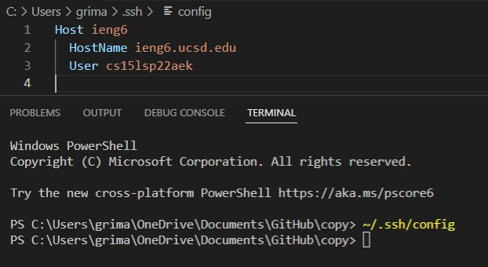
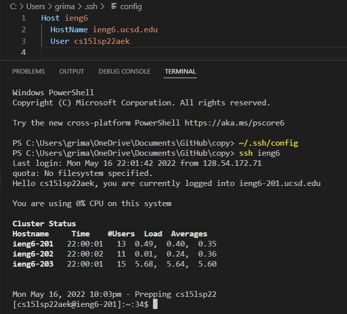
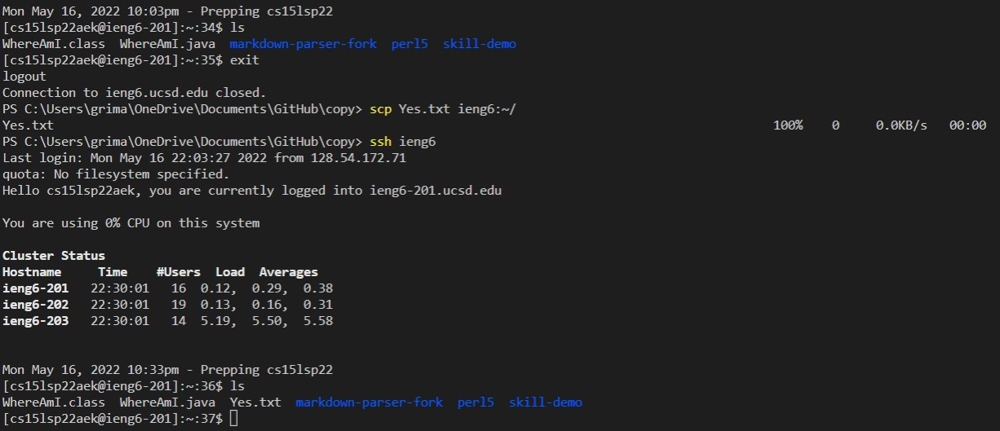

# Week 6 Lab Report

## Streamlining ssh Configuration
First, I ran `~/.ssh/config` and I opened it up in VS Code. I switched the Host name from `ieng.ucsd.edu` to `ieng6`. This is the alias that I had set. 

Then, I ran the command `ssh ieng6` that logged me into the correct account becuase `ieng6` was the alias for the Host name. 

Lastly, I added the `Yes.txt` file to my ieng6 account by running `scp Yes.txt ieng6:~/`.

## Setup Github Access from ieng6
This part was confusing and I couldn't figure it out.

## Copy whole directories with `scp -r`
Same with this. 

[Home](https://pgrimaldo03.github.io/cse15l-lab-reports/)