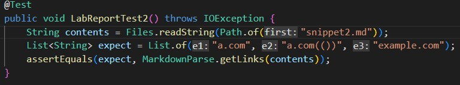
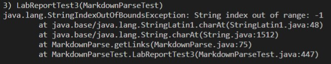

# Week 8 Lab Report

## *Links used:*
1. [My groups markdown-parse repository used](https://github.com/jina-leemon/markdown-parser)
2. [markdown-parse repository we reviewed](https://github.com/TheJoeship/markdown-parser-fork)

---
## *Tests:*
## Snippet 1 
I used the VS Code preview function to look at which of the links would actually provide a link. From there I decided to add the three out of the four that were actual links to the list of links we had. 

My Groups Repo: 

Reviewed Repo: 

## Snippet 2  
For this Snippet I also used the VS Code preview function to look at which of the links would actually provide a link. From there I decided to add all three based on the preview it let me know what links would be links.  

My Groups Repo: 

Reviewed Repo:

## Snippet 3  
For this Snippet I also used the VS Code preview function to look at which of the links would actually provide a link. I noticed that for this Snippet it didn't give me the links the same way the other ones gave them to me (hilighted in blue) it gave me the full link. 

My Groups Repo: 

Reviewed Repo:

---
## *Questions:* 
1. I think that there may be a fix because since the md file is using backticks as 'inline code' it should ignore these and still provide the link. That is probably why for the actual outcome the url is still included and I think it can be done in <10 lines of code.   
2. For this one, I am struggling a bit trying to see how to get the furthest parenthesis in order to include the rest of the paranthesis that the link is missing instead of cutting it short. I think it could probably take >10 lines of code to solve this one. 
3. I think that in order to solve this one in <10 lines of code would be by stripping the blank text because I think that because of all the spaces it takes longer to find the links and that could be why they come back as the full url and not in the text inside the brackets. 

[Home](https://pgrimaldo03.github.io/cse15l-lab-reports/)