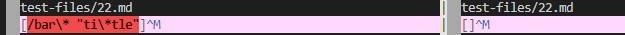
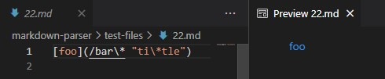
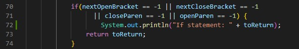
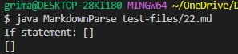
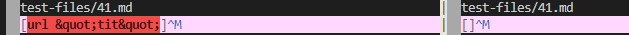
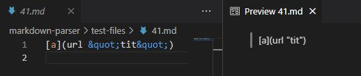

# Week 10 Lab Report

By using `vimdiff` I was able to get different results for the follwing tests. 

## Test 1
[Link to test-file 22](https://github.com/nidhidhamnani/markdown-parser/blob/main/test-files/22.md)

The left is my implementation and the right is their implementation.

For this test, my implementation is correct because based on the preview there should be a link provided.

Code:

I think that this is where the problem lies because one of the bracket variables returned -1. Since it returned -1, then it means that it wasn't found in the link provided, however since the link was valid it should have returned the link inside the parenthesis. 

## Test 2
[Link to test-file 41](https://github.com/nidhidhamnani/markdown-parser/blob/main/test-files/41.md)

The left is my implementation and the right is their implementation.

My implementation was wrong because as seen on the preview there should not be a link. 

The issue with this test would be that because of the way it is formatted with the two links, cause markdown not to consider it a link. The markdown format for a link is correct but for some reason it does not recognize it as a link. I'm not sure where in the code the problem is but I think it is because my implementation doesn't accept those key words.  

[Home](https://pgrimaldo03.github.io/cse15l-lab-reports/)